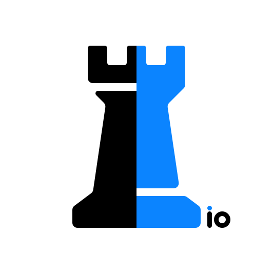

<div align="center">



# io-chess

<a href="https://lichess.org/@/io-bot"></a>

<a href="https://lichess.org/@/io-bot/perf/bullet"></a>
<a href="https://lichess.org/@/io-bot/perf/blitz"></a>
<a href="https://lichess.org/@/io-bot/perf/rapid"></a>
<br>
<a href="https://lichess.org/@/io-bot"></a>
<a href="https://lichess.org/@/io-bot"></a>
<a href="https://lichess.org/@/io-bot"></a>

<br />

[**Website**](https://www.io-chess.com/) &nbsp;&nbsp;•&nbsp;&nbsp; [**Challenge on Lichess**](https://lichess.org/@/io-bot) &nbsp;&nbsp;•&nbsp;&nbsp; [**Documentation**](https://alessandro-gobbetti.github.io/io-chess-engine/)

</div>

<br/>

**io-chess** is a UCI-compatible chess engine written in modern C++20. It combines a high-performance alpha-beta search with a natively-compiled **Factorized Mixture-of-Experts (MoE)** neural network for position evaluation, achieving competitive play **without any runtime dependency on ONNX or other ML frameworks**.


## Project Structure

The project is designed end-to-end, spanning data acquisition, feature extraction, neural network training, and the final engine binary. It is divided into four major modules:

*   **[Engine](engine/)**: The core C++ chess engine featuring Negamax search with PVS, Lazy SMP multi-threading, Syzygy tablebase support, Polyglot opening books, and the natively-compiled MoE evaluation.
*   **[Preprocessing](preprocessing/)**: A high-performance C++ pipeline that extracts spatial features from millions of chess positions and writes them to compact binary datasets.
*   **[Training](training/)**: A PyTorch training pipeline for the Factorized MoE network, implementing a multi-phase curriculum for expert specialization and weight export.
*   **[Data](data/)**: Python and shell utilities for downloading, filtering, and shuffling the HuggingFace evaluation dataset.

For a comprehensive overview of the architecture, please refer to the [Documentation](https://alessandro-gobbetti.github.io/io-chess-engine/).

## Architecture Highlights

### Search
The search relies on Principal Variation Search (PVS) with Iterative Deepening.
*   **Parallelism**: Lock-free Lazy SMP for multi-threaded node evaluation.
*   **Pruning & Reductions**: Null Move Pruning (NMP), Late Move Reductions (LMR), Futility Pruning, Reverse Futility Pruning, Delta Pruning, and Singular Extensions.
*   **Move Ordering**: Hash move priority, winning captures (SEE), Killer moves, Counter moves, and History heuristics.
*   **Endgame & Openings**: Syzygy Endgame Tablebases probing (up to 6 pieces) and Polyglot-format opening book support.

### Evaluation
*   **Factorized MoE Neural Network**: The primary evaluator is a Factorized Mixture-of-Experts network trained on hundreds of millions of positions. It uses a 1x1 Mixer, a Router, and 4 specialized Expert Bodies (Tactical, Strategical, Major endgame, Minor endgame). 
*   **Incremental Updates**: A double-accumulator tracks incremental feature deltas, allowing inference in under 1 μs per position.
*   **Native Execution**: The network is compiled directly to native C++ with SIMD-optimized inference, requiring no external ML runtimes.
*   **Heuristic Fallback**: A classical evaluation (PeSTO Piece-Square Tables) is used when no neural network weights are loaded.

## Building the Engine

### Prerequisites
*   A C++20 compiler (GCC ≥ 12, Clang ≥ 15, or Apple Clang ≥ 14)
*   CMake ≥ 3.20
*   *(Optional)* Python ≥ 3.10 with PyTorch for training
*   *(Optional)* Polyglot-format opening book
*   *(Optional)* Syzygy tablebases for endgame probing

### Native Build (Linux / macOS)

```bash
cd engine
mkdir build && cd build
cmake .. -DCMAKE_BUILD_TYPE=Release
make -j$(nproc)
```

The compiled binary `io-chess` will be available in the `build` directory.

### WebAssembly Build (Emscripten)

The WASM build uses Emscripten and relies on `SharedArrayBuffer` for threading support (Pthreads). 

```bash
cd engine
mkdir build_wasm && cd build_wasm
emcmake cmake -DCMAKE_BUILD_TYPE=Release ..
emmake make -j$(nproc)
```

## Usage

**io-chess** communicates via the Universal Chess Interface (UCI) protocol and can be attached to standard GUIs (e.g., Cute Chess, Arena, Lichess-bot).

**Command-Line Options:**
```bash
./io-chess --model <path>           # Path to native_weights.bin directory (required for Neural eval)
./io-chess --simple-eval            # Use classical PeSTO evaluation (no model needed)
./io-chess --syzygy <path>          # Path to Syzygy tablebases (optional; also reads SYZYGY_PATH env)
./io-chess --book <path>            # Path to Polyglot opening book (optional)
./io-chess --book2 <path>           # Path to secondary opening book (optional)
```

**Supported UCI Commands:**
*   `uci`: Identify engine and display parameters.
*   `isready`: Initialize internal memory and verify readiness.
*   `position [startpos | fen <fen>] moves <moves>`: Configure the board state.
*   `go [depth <limit> | wtime <ms> btime <ms>]`: Begin search algorithm.
*   `quit`: Terminate the process.

## Documentation

Full architectural documentation is hosted online at **[Documentation](https://alessandro-gobbetti.github.io/io-chess-engine/)**.

To generate the documentation locally:

```bash
doxygen Doxyfile
```

## License

This project is licensed under the **GNU General Public License v3.0** — see the [LICENSE](LICENSE) file for details.

---

*Looking for the web interface? You can play against the engine and explore its architecture (and much more) at the [io-chess website](https://www.io-chess.com/), where everything runs entirely locally in your browser.*